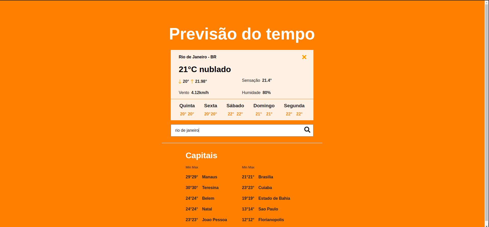
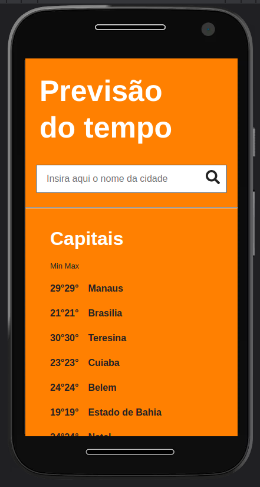
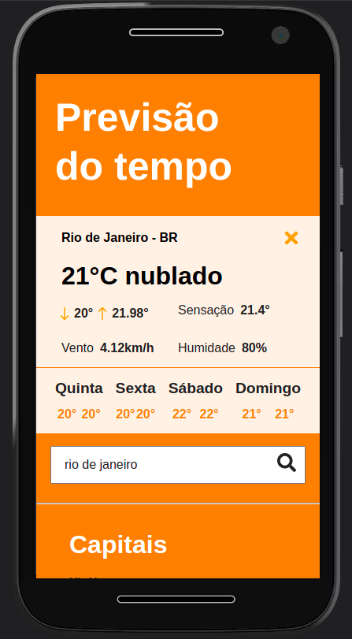

# Weather

## Running project

>### Weather API

> For de API queries to work, you will have to access the [Weather API](https://openweathermap.org/api), create an account and generate your `API_KEY`.

> After generate your `API_KEY`, create an `.env` file at the root of the project, in this file, create an environment variable called `API_KEY=YOUR_API_KEY_HERE`.

Install dependences

`$ yarn install`

Development build

`$ yarn dev`

Production build

 `$ yarn build`

Webpack dev-server

`$ yarn start`

 

### Search in Desktop

### Mobile

    
    

